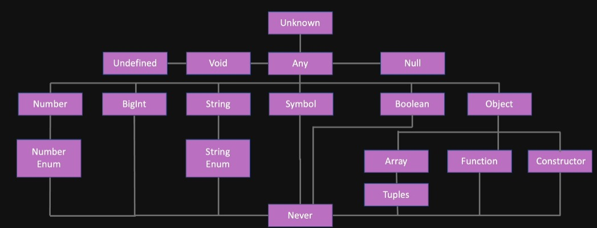

# Typescript

- By default even if there is error in code compiler will convert ***.ts into .js file***. To prevent this from happening, we can configure in tsconfig.json **```noEmitOnError:true```**
- **noImplicitAny: false** will disable error for **any** type. *It should be true*
- **target:** In which format the ts file will be transpiled to js. Example: ```target:"es2015"```.It depends on where you are using it either in browser, react , node etc.
- **lib**- depends on target. Also it means what library you want to include. By default most of libraries are included but if you explicitly write lib then you have to include libraries. Ex: **for react lib will include dom but for node it is not required.**
- **Preferable to use unknown** type instead of **any type** as it is more strict.
Also using unknown type we should have to check the type before using it.
- **BigInt:**
    - Can be initialize using two ways: ```let a= BigInt("123456")``` or ```let b= 123456789n```
    - int can be used for number max upto **2^53**. For number greater than that we can use BigInt
    - Cannot be defined as **decimal value**
    - Cannot use **Math** object on BigInt


 

- **never** type means code terminates after that    
- A **tuple** type is another sort of Array type that knows exactly how many elements it contains, and exactly which types it contains at specific positions.
    ``` type StringNumberPair = [string, number];```<br>
    - **Issue with tuple:**
    ```js
    let rgb: [number, number, number];

    // ✅ This is correct because it has all the values
    rgb = [225, 224, 10];

    // ❌ ERROR : Source has 4 element(s) but target allows only 3
    // It is not allowed Right.
    rgb = [225, 224, 10, 40];   

    // Now let's do this:
    rgb.push(50)
    console.log(rgb)  // output: [225, 224, 10, 50]
    // This is the flaw.
    ```
    ***You can apply any Array method to Tuple. That's why it destroys the supposed guarantees of tuple types.***
    

- PropTypes vs Interface:
    - Interface:
        - Not transpiled to js
        - Typescript throw error on compile time

    - PropTypes:
        - Transpiled to js
        - Throw error on runtime   

- Interface vs Types:
    - **Interface**:
        - **Can add new fields** to the existing interface.<br/>
            ```js
            interface User {
                id: string;    
                email: string;
            }

            interface User {
                name: string;
            }

            // Now you can add all the three values to the User interface
            const user: User = {
                id: "2323232",
                email: "foo@email.com",
                name: "Foo";
            }
            ```
        - For extending, Interface uses **extends** keyword
            ```js
            interface Car {
                model: string;
                color: string;
            }

            // 👇 You can extend an interface using 'extends' keywords
            interface Tesla extends Car {
            autoPilotModelName: string;
            };
            ```
        - **Cannot do Union** with Interface 
            ```js
            // ❌ ERROR: '{' expected.
            interface Person = User | Admin; 
            
            // ✅ CORRECT: However you can use union type inside the interface
            interface Person {
                person: User | Admin;
            }
            ```
    - **Types**:
        - **Cannot add new fields** to an existing type.<br/>
            ```javascript
            type User = {
                id: string;
            }

            type User = {
                email: string;
            }

            // ❌ ERROR: Duplicate identifier "User"
            ```
        - For extending, type uses **intersection**
            ```js
           type Car = {
                model: string;
                color: string;
            }
            // 👇 In type you need to use Intersection
            type Tesla = Car & {
            autoPilotModelName: string;
            };

            const newCar: Tesla = {
                model: "S",
                color: "red",
                autoPilotModelName: "xyz"
            }
            ```
        - **Can do Union** with types 
            ```js
            /// ✅ CORRECT: you can create union type like this
            type Person = User | Admin;
            ```       

- **Decorators:** Decorators are functions that can be attached to classes and their members, such as methods, and properties.
    - They are only called once
    - Called when class in defined
    - Called before class initilization i.e object creation
    - used with @decoratorName   
    - when used with class it requires only one parameter i.e **contructor fn**
    - when used with method it requires 3 paramters: **class prototype,method name and descriptors**
    - when used with paramter it requires 3 paramters: **class prototype,method name and index** // here method name in which method paramter is used and index denoted at which position is arguments in function       

- **infer type** is used only in case of conditional type.
    - **Syntax :**  
    ```ts 
    type ArrayElementType<T>= T extends (infer E)[]? E:T 
    ```      
    - **Example:**  
    ```ts 
    type TypeOne = ArrayElementType<string[]> 
    ```   
    ***Here answer will be inferred(E) as string as T will is of array type which return true then it will return E which will be inferred as string***

- **The satisfies operator** is a feature in TypeScript that allows you to check if a given type satisfies a specific interface or condition    
    ```ts
        type Keys = 'FirstName' |"LastName"| "age"|"school"

        const student = {
        FirstName: "Temitope",
        LastName: "Oyedele",
        age: 36,
        school:"oxford",
        }satisfies Record<Keys, string | number>;

        student.age.toFixed();
        student.school.toLowerCase();
    ```

- **Utility Types:**
    - ```Awaited<Type>```: Used with Promises.
        ```ts
        type A = Awaited<Promise<string>>; // type A will be string 
        ```
    - ```Record<Keys,Type>```: This utility can be used to map the properties of a type to another type.
        ```ts
        interface CatInfo {
          age: number;
          breed: string;
        }

        type CatName = "miffy" | "boris" | "mordred";
        
        const cats: Record<CatName, CatInfo> = {
            miffy: { age: 10, breed: "Persian" },
            boris: { age: 5, breed: "Maine Coon" },
            mordred: { age: 16, breed: "British Shorthair" },
        };
        ```   
    - ```Pick<Type, Keys>```: Constructs a type by picking the set of properties Keys (string literal or union of string literals) from Type.
        ```ts
        interface Todo {
          title: string;
          description: string;
          completed: boolean;
        }
        
        type TodoPreview = Pick<Todo, "title" | "completed">;
        
        const todo: TodoPreview = {
          title: "Clean room",
          completed: false,
        };
        ``` 
    - ```Omit<Type, Keys>```: Constructs a type by picking all properties from Type and then removing Keys (string literal or union of string literals).
        ```ts
        interface Todo {
          title: string;
          description: string;
          completed: boolean;
          createdAt: number;
        }

        type TodoPreview = Omit<Todo, "description">;
        
        const todo: TodoPreview = {
          title: "Clean room",
          completed: false,
          createdAt: 1615544252770,
        };
        ```
    - ```Partial<Type>```: Constructs a type with all properties of Type set to optional. This utility will return a type that represents all subsets of a given type.
        ```ts
        interface Todo {
          title: string;
          description: string;
        }

        function updateTodo(todo: Todo,     fieldsToUpdate: Partial<Todo>) {
           return { ...todo, ...fieldsToUpdate };
        }
        
        const todo1 = {
          title: "organize desk",
          description: "clear clutter",
        };
        
        const todo2 = updateTodo(todo1, {
        description: "throw out trash",
        });    
        ```
    
    - ```Required<Type>```: Constructs a type consisting of all properties of Type set to required. The opposite of Partial.
        ```ts
        interface Props {
          a?: number;
          b?: string;
        }

        const obj: Props = { a: 5 };
        
        const obj2: Required<Props> = { a: 5 };

        Property 'b' is missing in type '{ a: number; }' but required in type 'Required<Props>'.
        ```
    - ```Readonly<Type>```: Constructs a type with all properties of Type set to readonly, meaning the properties of the constructed type cannot be reassigned.
        ```ts
        interface Todo {
          title: string;
        }

        const todo: Readonly<Todo> = {
          title: "Delete inactive users",
        };
        
        todo.title = "Hello";
        Cannot assign to 'title' because it is a read-only property.
        ```  
    - ```Extract<Type, Union>```: Common type from union to Type.
        ```ts
        type T0 = Extract<"a" | "b" | "c", "a" | "f">;
        /// type T0 = "a"
        ```      

            
              


          